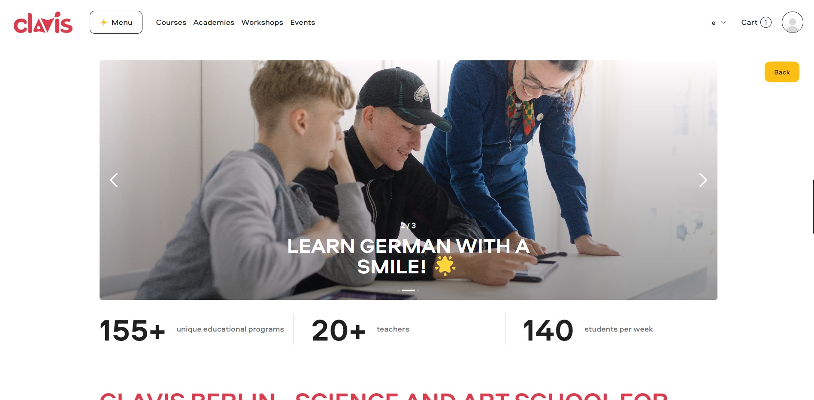
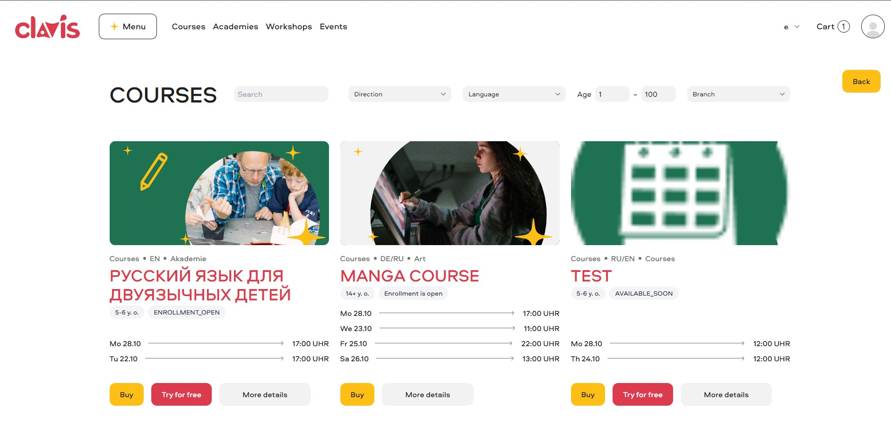

# Education-Aided System - Frontend (Vue.js)

This is the **frontend** of the **Education-Aided System**, which helps provide educational tools and resources for students, teachers, and administrators. The frontend is built using **Vue.js** and interacts with a backend API to provide functionalities like course management, assignments, and user dashboards.

## Preview




## Table of Contents

- [Installation](#installation)
- [Project Setup](#project-setup)
- [Features](#features)
- [Technologies](#technologies)
- [Running Locally](#running-locally)
- [Contributing](#contributing)
- [License](#license)

## Installation

To set up the **Education-Aided System** frontend, follow the steps below to install the necessary dependencies and run the application.

### Prerequisites

Ensure that you have the following installed:
- **Node.js** (LTS version recommended)
- **npm** or **yarn** (package manager)

### Steps to Install

1. Clone the repository:

   ```bash
   git clone https://github.com/yourusername/education-aided-system-frontend.git
   ```

2. Navigate into the project directory:

   ```bash
   cd education-aided-system-frontend
   ```

3. Install the dependencies using **npm** or **yarn**:

   - Using **npm**:
     ```bash
     npm install
     ```

   - Using **yarn**:
     ```bash
     yarn install
     ```

## Project Setup

### Configuration

Before running the app, you may need to set up the environment variables. Create a `.env` file in the root directory by copying from `.env.example` and adjust the configuration:

- `VUE_APP_API_URL`: The URL of the backend API (e.g., `http://localhost:5000/api`).
- `VUE_APP_PUBLIC_PATH`: Base path for the frontend assets (e.g., `/`).

Example:
```env
VUE_APP_API_URL=http://localhost:5000/api
VUE_APP_PUBLIC_PATH=/
```

### Running Locally

Once the dependencies are installed and environment variables are configured, you can run the app locally.

- Start the development server using **npm**:

  ```bash
  npm run serve
  ```

- Or using **yarn**:

  ```bash
  yarn serve
  ```

Your app will be available at [http://localhost:8080](http://localhost:8080).

## Features

- **User Authentication**: Register and log in users (students, teachers, admins).
- **Course Management**: View, create, and enroll in courses.
- **Assignments & Grades**: Students can submit assignments and view grades.
- **User Dashboards**: Personalized dashboards for students, teachers, and administrators.
- **Admin Panel**: Admins can manage users, courses, and settings.

## Technologies

This project is built using the following technologies:

- **Vue.js**: The progressive JavaScript framework for building the user interface.
- **Vue Router**: For managing routes and navigation.
- **Vuex**: For state management (storing user data, courses, assignments, etc.).
- **Axios**: For making HTTP requests to the backend API.
- **BootstrapVue**: For responsive design and UI components.
- **Sass**: For styling and CSS pre-processing

## Running Locally

To run the app locally on your machine, make sure to follow these steps:

1. Install all dependencies.
2. Set the appropriate environment variables (refer to the `.env` file).
3. Run the project using `npm run serve` or `yarn serve`.
4. Visit [http://localhost:8080](http://localhost:8080) to view the frontend.

## Contributing

We welcome contributions from the community! To contribute:

1. Fork the repository
2. Create a new branch (`git checkout -b feature/your-feature`)
3. Commit your changes (`git commit -am 'Add new feature'`)
4. Push to your branch (`git push origin feature/your-feature`)
5. Create a new Pull Request

Please ensure that your code follows the existing code style and includes relevant tests and documentation.

## License

This project is licensed under the MIT License - see the [LICENSE](LICENSE) file for details.
